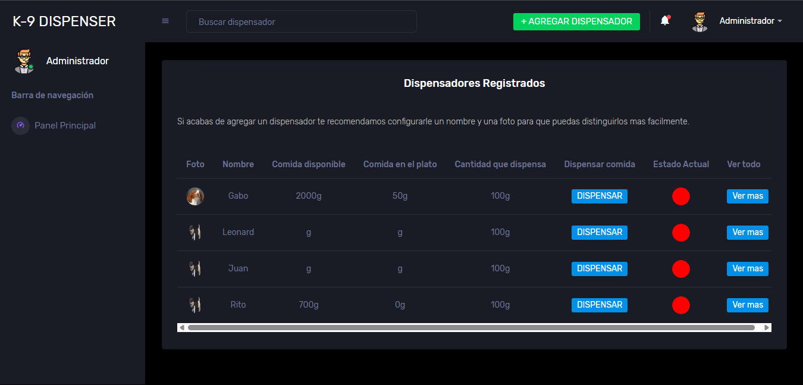

# 🐾 Dispensador K9 - Aplicación Web

Aplicación web en **PHP puro** para simular el control de un dispensador de alimento para mascotas.  
Este proyecto sirvió para establecer una base sólida en desarrollo backend, gestión de bases de datos y autenticación de usuarios.

> 

---

## 🎯 Características Principales

- **Autenticación de Usuarios:** Sistema completo de registro e inicio de sesión.  
- **Panel de Control:** Interfaz principal para la gestión del dispensador.  
- **Cuenta de Demostración:** Acceso para visitantes con un usuario de prueba para explorar la funcionalidad.  
- **Backend en PHP:** Toda la lógica de negocio se maneja con PHP sin frameworks.  

---

## 🛠️ Tecnologías Utilizadas

- PHP (puro)
- MySQL
- HTML, CSS, JavaScript
- XAMPP

---

## 🚀 Instalación Local

Para ejecutar este proyecto en tu propia máquina, sigue estos pasos:

1. **Clona el repositorio:**

  ```bash
   git clone https://github.com/tu-usuario/k9dispenser.git
  ```

2. **Mueve el proyecto:**

   Copia la carpeta `k9dispenser` dentro de tu directorio `htdocs` de XAMPP  
   (por ejemplo: `C:\xampp\htdocs\` en Windows).

3. **Inicia XAMPP:**

   Abre el panel de control de XAMPP e inicia los servicios de **Apache** y **MySQL**.

4. **Crea e importa la base de datos:**

   - Abre **phpMyAdmin** y crea una nueva base de datos llamada `k9dispenser`.
   - Ve a la pestaña **Importar** y selecciona el archivo `database/k9dispenser.sql`.

   > 📁 Asegúrate de que el archivo `.sql` esté presente en la carpeta `/database` del repositorio.

5. **Configura la conexión:**

   Abre el archivo `Controlador/conexion.php` y modifica las constantes de conexión con tus credenciales locales de XAMPP.

6. **Accede al proyecto:**

   Abre tu navegador y ve a: http://localhost/k9dispenser/ (o el puerto que uses, ej: http://localhost:8081/k9dispenser/).


## Instalacion del dispensador

1. **Abre el archivo**
   Abre el archivo llamado `codigoPlacaESP32.ino` que se encuentra en la carpeta raiz de este poryecto llamdo `codigoPlacaESP32` con tu IDE de arduino.

2. **Conecta tu placa e instala las dependencias importadas en el archivo.**

3. **Ejecuta el codigo.**


   ---

## 🌐 Demo en Línea

Puedes probar una versión en vivo de este proyecto desplegada en **InfinityFree**.

- **URL:** [http://tu-proyecto.epizy.com/k9dispenser/]()  
- **Usuario de prueba:** `demo`  
- **Contraseña:** `k9admin`

---

## 📝 Nota del Proyecto

> Este proyecto representa una etapa importante de mi aprendizaje.  
> Aunque hoy en día utilizaría frameworks y arquitecturas más modernas, estoy orgulloso del trabajo realizado, ya que me permitió dominar los fundamentos del desarrollo web del lado del servidor.
